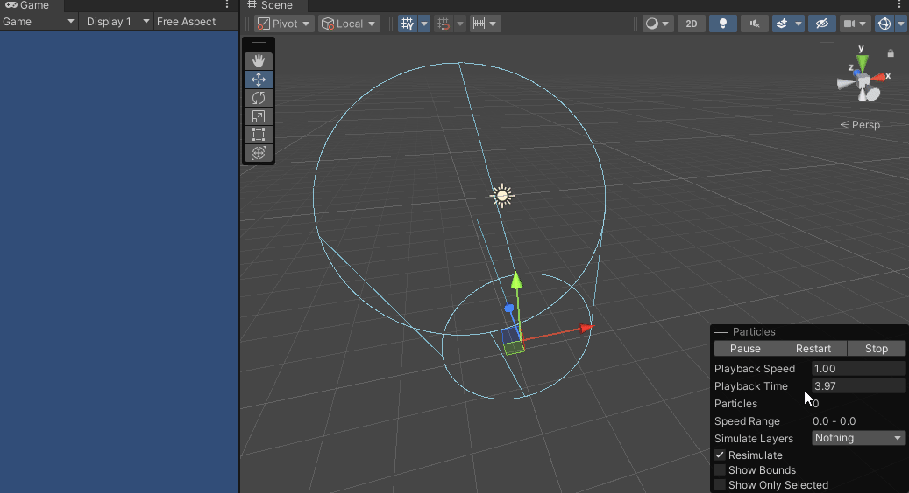
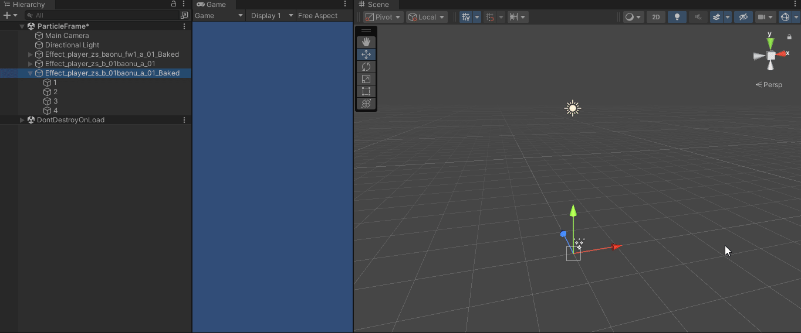
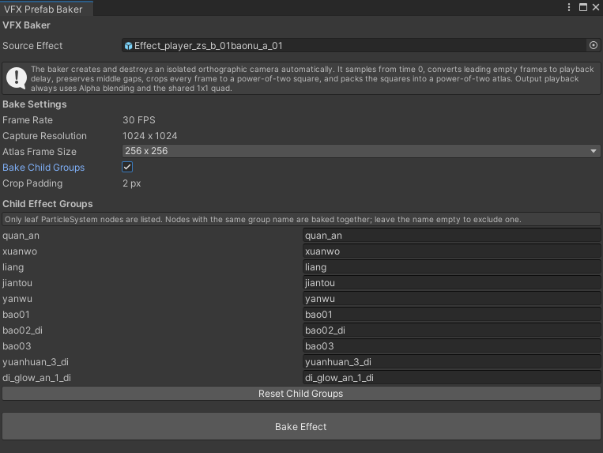
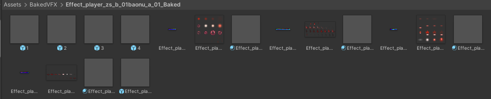

# Unity VFX Baker

将 Unity `ParticleSystem` 特效离线烘焙为透明序列帧 Atlas，并使用共享 Quad、数据纹理和 Billboard Shader 在运行时播放。

该工具适合将复杂粒子特效转换为成本更稳定的网格动画，减少运行时粒子模拟开销。支持完整特效烘焙，也支持把多个叶子粒子节点手动合并为若干独立分组 Prefab。





## 主要功能

- 自动创建临时正交相机，不需要手动指定相机或 Pivot。
- 自动估算特效持续时间和相机包围范围。
- 以 30 FPS、1024 × 1024 捕获源画面。
- 通过黑底和白底两次渲染重建 Straight Alpha，兼容部分没有有效 Alpha 输出的 Additive 粒子 Shader。
- 自动裁剪有效像素，并统一输出为 64、128、256 或 512 的正方形帧。
- Atlas 宽高均为 2 的幂，空帧不占用 Atlas 区域。
- 使用两行 RGBAFloat 数据纹理保存逐帧位置、缩放和 UV。
- 所有结果共享同一个 1 × 1 Quad。
- Shader 使用 Billboard，使烘焙特效始终面向当前相机。
- 支持延迟播放、循环播放、透明度控制以及播放完成后自动隐藏。
- 支持递归寻找叶子 `ParticleSystem` 节点并进行手动分组烘焙。

## 环境

当前版本基于 Unity 2022.3 LTS 和 URP 开发。其他 Unity 版本或渲染管线尚未完整验证。

源特效需要使用 Unity `ParticleSystem`。VFX Graph 当前不在支持范围内。

## 安装

将整个 `VFXBaker` 文件夹复制到 Unity 项目的 `Assets` 目录：

```text
Assets/
└─ VFXBaker/
   ├─ Editor/
   │  └─ SceneVFXBakerWindow.cs
   ├─ Runtime/
   │  └─ BakedVFXPlayer.cs
   └─ Shaders/
      └─ BakedParticleAtlas.shader
```

Unity 完成脚本编译后，通过以下菜单打开工具：

```text
Tools > VFX > VFX Prefab Baker
```

## 基本使用

1. 将包含 `ParticleSystem` 的 Prefab 或场景对象拖入 `Source Effect`。
2. 在 `Atlas Frame Size` 中选择单帧输出尺寸。
3. 如需把整个特效烘焙为一个结果，保持 `Bake Child Groups` 关闭。
4. 点击 `Bake Effect`。
5. 烘焙结果生成在 `Assets/BakedVFX/<特效名>_Baked/`。



### 单帧尺寸

可选尺寸如下：

| 尺寸 | 建议用途 |
|---|---|
| 64 | 很小或远景特效，文件最小 |
| 128 | 小型特效 |
| 256 | 默认设置，质量和体积较均衡 |
| 512 | 近景或细节较多的特效 |

尺寸越高，单帧越清晰，但 Atlas 显存和文件体积会明显增加。

## 子特效分组烘焙

开启 `Bake Child Groups` 后，窗口会递归扫描源对象，仅列出层级最深、实际挂有 `ParticleSystem` 的叶子节点。中间容器不会显示，也不能直接参与分组。

例如：

```text
Effect_A
└─ Container
   ├─ Effect_1
   ├─ Effect_2
   ├─ Effect_3
   └─ Effect_4
```

分组设置可以填写为：

```text
Effect_1 → Start
Effect_2 → Main
Effect_3 → Main
Effect_4 → End
```

规则：

- 相同组名的节点会在同一次捕获中合并烘焙。
- 组名留空表示跳过该叶子节点。
- 每组生成独立的 Atlas、AnimTexture、Material 和 Prefab。
- 子分组 Prefab 直接使用填写的组名，例如 `Start.prefab`。
- 最终总 Prefab 以嵌套 Prefab 的方式引用所有分组结果。

示例输出：

```text
Effect_A_Baked.prefab
├─ Start
├─ Main
└─ End
```

每个分组根节点直接挂载：

- `MeshFilter`
- `MeshRenderer`
- `BakedVFXPlayer`

不会额外创建名为 `Renderer` 的中间节点。

## 输出文件

典型输出目录：

```text
Assets/BakedVFX/Effect_A_Baked/
├─ Effect_A_<组名>_Atlas.png
├─ Effect_A_<组名>_Anim.asset
├─ Effect_A_<组名>_Material.mat
├─ <组名>.prefab
└─ Effect_A_Baked.prefab
```



共享 Quad 位于：

```text
Assets/BakedVFX/Shared/BakedVFX_UnitQuad.asset
```

工具不再生成 `BakedVFXAsset` ScriptableObject。Mesh、Material、Bounds 和播放器组件会直接写入输出 Prefab。

## BakedVFXPlayer

生成的 Prefab 使用 `BakedVFXPlayer` 控制播放。

| 属性 | 作用 |
|---|---|
| Play On Enable | 对象启用时自动播放 |
| Restart On Enable | 再次启用对象时从头播放 |
| Play Delay | 延迟播放时间，单位为秒；烘焙器会自动写入首部空帧对应的延迟 |
| Loop | 是否循环播放 |
| Hide On Complete | 非循环播放结束后，通过 `forceRenderingOff` 隐藏 Renderer |
| Alpha | 当前实例的整体透明度 |

运行时接口：

```csharp
var player = GetComponent<BakedVFXPlayer>();

player.Play();
player.Restart();
player.Stop();
player.SetAlpha(0.5f);
```

`Play()` 和 `Restart()` 会自动将 `MeshRenderer.forceRenderingOff` 恢复为 `false`。非循环动画结束且开启 `Hide On Complete` 时，播放器会将其设为 `true`，避免最后一帧持续显示和继续产生 DrawCall。

## 空帧处理

空帧按所在位置进行不同处理：

- 首部空帧：不写入动画数据，转换为 Player 的自动 `Play Delay`。
- 中间空帧：保留时间位置，在 AnimTexture 中记录为缩放为 0 的帧，但不占 Atlas 区域。
- 尾部空帧：移除。

例如：

```text
原始时间轴：空 A B 空 空 C D 空
AnimTexture：   A B 空 空 C D
Atlas：         A B       C D
Play Delay：1 / 30 秒
```

这样可以保留原特效中间的停顿，同时避免为空帧分配无意义的 Atlas 空间。

## AnimTexture 数据格式

`*_Anim.asset` 是一张 `RGBAFloat` 数据纹理，不是 AnimationClip。

- 宽度：动画时间轴帧数。
- 高度：固定为 2。
- Filter Mode：Point。
- Wrap Mode：Clamp。

每一列对应一帧：

| 行 | R/G | B/A |
|---|---|---|
| 第 0 行 | 帧中心位置 X/Y | Quad 缩放 X/Y |
| 第 1 行 | Atlas UV 起点 U/V | Atlas UV 宽度/高度 |

Shader 根据时间计算当前帧：

```text
frame = floor((当前时间 - startTime) / frameTime)
```

然后读取该列的数据，调整共享 Quad 的大小、位置和 Atlas UV。

## 透明通道重建

工具分别在黑色和白色背景上渲染同一帧，然后通过两次结果的差值估算覆盖率：

```text
transmission  = average(white.rgb - black.rgb)
coverageAlpha = 1 - transmission
emissionAlpha = max(black.rgb)
alpha         = max(coverageAlpha, emissionAlpha)
rgb           = black.rgb / alpha
```

`emissionAlpha` 用于处理 Additive Shader 没有写入有效 Alpha 的情况。最终输出统一为 Straight Alpha，并使用：

```text
Blend SrcAlpha OneMinusSrcAlpha
```

## Billboard

运行时 Shader 使用相机的 Right 和 Up 向量构造 Quad 的世界坐标。对象的世界位置和缩放会被保留，原旋转不参与最终朝向，因此特效始终正对当前相机。

## 常见问题

### 烘焙时提示没有可见粒子

可能原因：

- 粒子在自动检测的持续时间内没有发射。
- 源 Shader 不支持当前相机或渲染管线。
- URP Renderer Feature、Layer 或 Shader Pass 对临时相机进行了过滤。
- 特效依赖场景光照、深度纹理、Opaque Texture 或其他外部状态。

失败时工具会将诊断图像写入：

```text
Assets/BakedVFX/Diagnostics/
```

同时检查 Unity Console 中的相机参数、粒子数量和 Renderer 报告。

### 烘焙结果比原特效模糊

- 提高 `Atlas Frame Size`。
- 检查原特效是否包含非常大的运动范围；范围越大，单个粒子分配到的有效像素越少。
- 避免对生成的 Atlas 再次进行有损压缩。
- 近景特效建议使用 256 或 512。

### Additive 特效亮度与原效果有差异

工具会将 Additive 黑底能量转换为 Straight Alpha。该过程可以消除黑底，但与多层 Additive 粒子直接叠加并不完全等价，极亮区域或多层叠加可能存在视觉差异。

### 非循环特效停留在最后一帧

确认 `Hide On Complete` 已开启。播放结束后 Player 会设置：

```csharp
meshRenderer.forceRenderingOff = true;
```

## 当前限制

- 固定以 30 FPS 采样和播放。
- 单次自动检测持续时间上限为 30 秒。
- 只处理 Unity `ParticleSystem`，不处理 VFX Graph。
- 分组界面只显示最深层的叶子 ParticleSystem 节点。
- Billboard 固定面向相机，不保留源粒子 Renderer 的其他对齐模式。
- 高度依赖场景深度、特殊 Renderer Feature 或自定义 Render Pass 的 Shader 可能需要单独适配。
- 最终 Atlas 不能超过当前 GPU 的最大纹理尺寸。

## 源码结构

```text
Editor/SceneVFXBakerWindow.cs
    编辑器窗口、粒子采样、相机适配、黑白图重建、裁剪、Atlas 打包和 Prefab 输出。

Runtime/BakedVFXPlayer.cs
    运行时选帧、延迟、循环、透明度以及播放完成后的隐藏控制。

Shaders/BakedParticleAtlas.shader
    AnimTexture 解码、Atlas 采样、Straight Alpha 混合和 Billboard 顶点变换。
```
